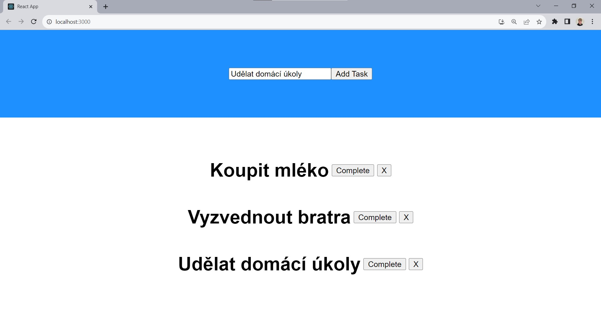
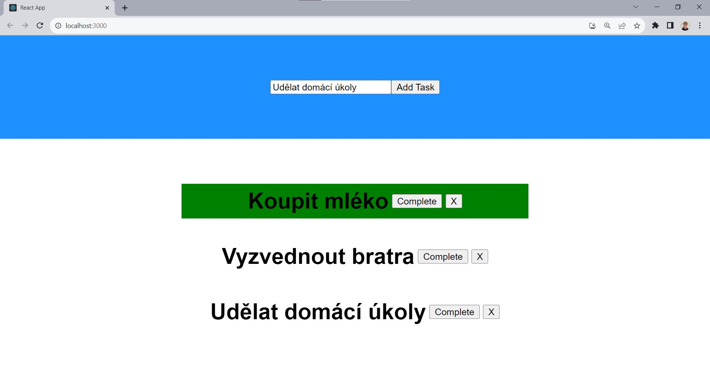

# simple-react-todoApp

Vytvořil jsem jednoduchou aplikaci, která funguje jakožto To Do. Cílem zde nebylo vytvořil stylově krásnou aplikaci ale pouze procvičit logiku ve React.
Podstatné zde bylo procvičit práci se komponenty, filet & map funkcemi a celkově logiku jako přidání a smazání tasku či označit zda je task hotov. Aplikace postrádá věci
jako local storage nebo pár dalších funkcionalit třeba jako task znovu odznačit pokud byl označet omylem.

